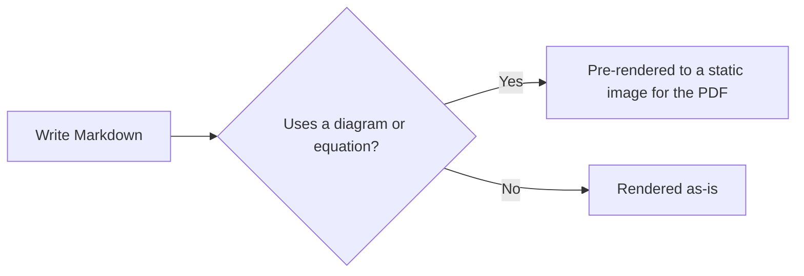

<!-- 
# Copyright (c) 2025-2026 Mark Buckwell and contributors
# SPDX-License-Identifier: MIT
-->

{{ heading_counter_reset(page) }}

# Section {: #section4 }

## SubSection {: #table-caption-example }

/// table-caption
prodockit capabilities demonstrated in this document
///

| Capability | Syntax | Where |
|---|---|---|
| Citations | `\cite{id}` | Section 1 |
| Acronyms | `\gls{id}` | Section 1 |
| Glossary | `\gls{id}` | Section 1 |
| Cross-references | `\ref{id}` | Section 2 |
| Figure captions | `/// figure-caption` | Section 3 |
| Table captions | `/// table-caption` | this table |
| Diagrams | ` ```mermaid ` fence | this section |
| Maths | `$$...$$` | this section |

Above is an example of a captioned table. Like a figure caption, it's automatically numbered and prefixed with the current chapter number.

### SubSubSection {: #section4-subsubsection-1 }

### SubSubSection {: #section4-subsubsection-2 }

## SubSection {: #diagrams-example }



Above is an example of a Mermaid diagram, defined with a ` ```mermaid ` fenced code block. The website renders it client-side via Mermaid.js; since WeasyPrint has no JS engine, the PDF instead pre-renders it to a static image at build time via the `tools/mermaid`/`tools/mathjax` Node tooling (see "Directory structure" in the User Guide's customise.md) - both from the exact same source, with no changes needed between the two.

## SubSection {: #maths-example }

$$
\cos x=\sum_{k=0}^{\infty}\frac{(-1)^k}{(2k)!}x^{2k}
$$

Above is an example of a TeX equation, written with the same `$$...$$` syntax as Zensical's own MathJax support. The PDF pre-renders it to a static image the same way it does the diagram above, rather than showing the raw LaTeX source.

### SubSubSection {: #section4-subsubsection-3 }

## SubSection {: #section4-subsection-3 }

### SubSubSection {: #section4-subsubsection-4 }

