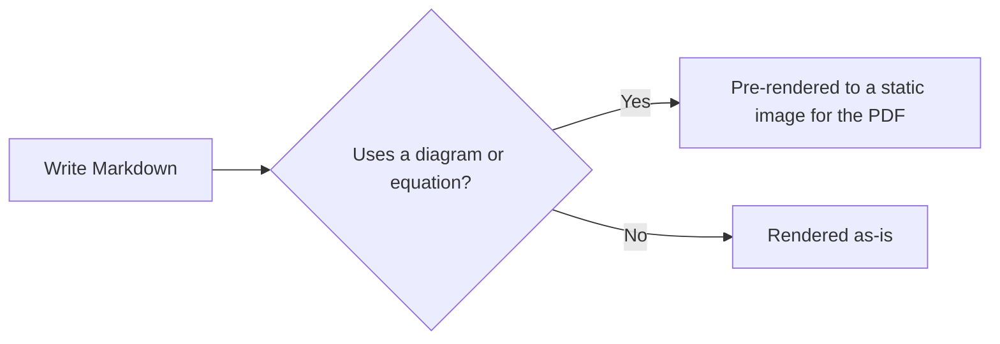

<!-- 
# Copyright (c) 2025-2026 Mark Buckwell and contributors
# SPDX-License-Identifier: MIT
-->

{{ heading_counter_reset(page) }}

# Section {: #section4 }

## SubSection {: #table-caption-example }

| Capability | Syntax | Where |
|---|---|---|
| Citations | `\cite{id}` | Section 1 |
| Acronyms | `\gls{id}` | Section 1 |
| Glossary | `\gls{id}` | Section 1 |
| Cross-references | `\ref{id}` | Section 2 |
| Figure captions | `/// figure-caption` | Section 3 |
| Table captions | `/// table-caption` | this table |
| Cell shading {: shade="8%" } | `shade="8%"` or `shade="off"` | this table |
| Diagrams | ` ```mermaid ` fence | this section |
| Maths | `$$...$$` | this section |
| Directory trees | `/// tree` | this section |
| Numbered steps | `/// steps` | this section |
/// table-caption | <
prodockit capabilities demonstrated in this document
///

Above is an example of a captioned table. Like a figure caption, it's automatically numbered and prefixed with the current chapter number.

### SubSubSection {: #section4-subsubsection-1 }

### SubSubSection {: #section4-subsubsection-2 }

## SubSection {: #diagrams-example }



Above is an example of a Mermaid diagram, defined with a ` ```mermaid ` fenced code block. The website renders it client-side via Mermaid.js; since WeasyPrint has no JS engine, the PDF instead pre-renders it to a static image at build time via the `tools/mermaid`/`tools/mathjax` Node tooling (see "Directory structure" in the User Guide's customise.md) - both from the exact same source, with no changes needed between the two.

## SubSection {: #maths-example }

$$
\cos x=\sum_{k=0}^{\infty}\frac{(-1)^k}{(2k)!}x^{2k}
$$

## SubSection {: #tree-example }

/// tree
docs/ - everything that becomes a page and a PDF section
  index.md - the cover page
  section1.md - the first section
  assets/ - images, logos and anything else the document embeds
    diagram.png
references.bib - the sources \cite{} resolves against
///

Above is an example of a directory tree. Indentation is the structure and a
trailing `/` marks a directory, so it stays readable as plain text and
survives a rename - unlike a hand-aligned block of box-drawing characters,
which has to be redrawn every time a name changes.

## SubSection {: #steps-example }

/// steps
1. Write your Markdown.

    Anything in `docs/` becomes a page of the website and a section of the
    PDF.

2. Build it.

    ```bash
    zensical build
    ```

3. Read what you wrote.
///

Above is an example of numbered steps: a number to find your place by, room
for a command and its explanation, and a line joining one step to the next.
Useful anywhere a method has to be repeatable by somebody else.

Above is an example of a TeX equation, written with the same `$$...$$` syntax as Zensical's own MathJax support. The PDF pre-renders it to a static image the same way it does the diagram above, rather than showing the raw LaTeX source.

## SubSection {: #code-example }

``` bash
git clone https://gitlab.com/your-group/your-project
cd your-project
python -m venv .venv
source .venv/bin/activate
pip install -r requirements.txt
```

Above is an example of a code listing, written as a ` ```bash ` fenced code block. Unlike the diagram and the equation, nothing pre-renders it - the same text reaches both outputs directly. It is here so that both the website and the PDF are exercised on a *multi-line* listing: a code block that loses its preformatting reflows into a paragraph, and a single line has no line breaks to lose (prodockit-extensions#207).

### SubSubSection {: #section4-subsubsection-3 }

## SubSection {: #section4-subsection-3 }

### SubSubSection {: #section4-subsubsection-4 }
